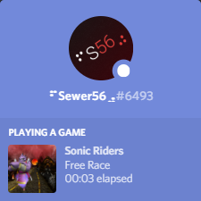

	<h1>Reloaded II: Sonic Heroes Rich Presence</h1>
	
	   
	<strong>Rich Presence? For an emulated game? </strong>
    
Wait, wait, wait!! This isn't Shadow The Hedgehog!

<b>Id: Riders.Utils.DiscordRPC</b>

# About This Project

This is a [Reloaded II](https://github.com/Reloaded-Project/Reloaded-II) Mod Loader mod that provides Discord Rich Presence support for Sonic Riders.

## How to Use

**A.** Install Reloaded mod as usual. (Extract to mod directory)

**B.** Enable mod and run the game.